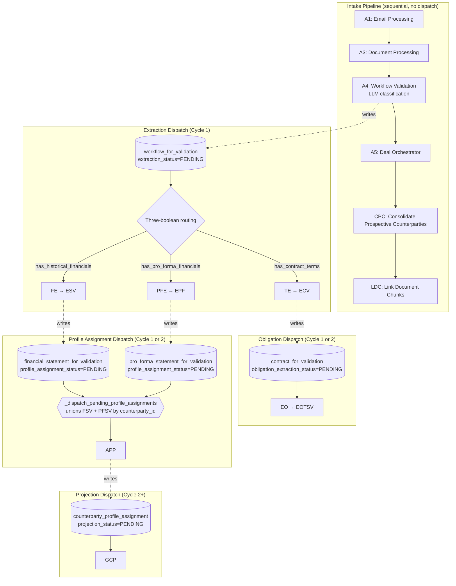

# CRDR Pipeline Routing — Reference

Status: current-state reference for how a document flows from intake through the classification and dispatch logic that decides which extraction stages run against it. Intended to seed branch chats that touch A4 (`workflow_validation.py`), the extraction dispatcher in Railway's polling loop, or the inbox edit flow in Next.js.

This document describes **what classifies a document** and **what that classification causes to run**. It does not cover per-stage internals (deferred to a future expansion of `RAILWAY_SERVICE.md` per `SUBPROJECT_HOUSEKEEPING.md` Thread 6) or dispatch loop mechanics (covered in `RAILWAY_SERVICE.md` §Polling Loop Architecture). For schema ground truth see `SUPABASE_SCHEMA.md`; for the validate routes that re-trigger dispatch see `NEXTJS_CONTRACT.md`.

---

## 1. Scope

The Corridor pipeline runs end-to-end without human gates. Between "a document arrived" and "the extraction stages ran" sits the classification step (A4) and the dispatcher that reads its output. Two related but distinct concerns live here:

- **Classification** — semantic judgment about what a document IS. One LLM call produces a structured verdict.
- **Dispatch** — deterministic mapping from classification output to a list of extraction stages. No LLM involvement.

This document covers both. Per-stage internals (what TE, FE, PFE, etc. do when they run) are out of scope.

---

## 2. The Two Axes

Classification and dispatch meet at a single row of `workflow_for_validation`. A4 writes the row; the extraction dispatcher reads it. Everything interesting about the bridge between "document received" and "extraction ran" is about what gets written onto that row and how the dispatcher interprets it.

**Classification output (A4 writes):** LLM verdict in structured form — a counterparty name, a content-flags enum, three independent boolean content flags, a prospect/intent classification, and reporting metadata.

**Dispatch input (Railway reads):** the three boolean content flags, falling back to the enum for pre-migration rows.

The separation is important. Classification is where LLM reasoning happens and where semantic ambiguity lives. Dispatch is pure table-driven routing — once the booleans are set, what runs is deterministic and auditable.

---

## 3. Classification: A4's Logic

### Overview

A4 (`pipeline/workflow_validation.py`, formerly `establish_workflow_for_validation`) runs inside the intake pipeline between A3 (document processing) and A5 (deal orchestrator). For each document, it:

1. Builds an analysis payload from the document's first several chunks plus email metadata (subject, body).
2. Loads the classification prompt from `crdr_prompt` (row `CRDR_PROMPT_17`), falling back to an in-code prompt if the row is absent or inactive.
3. Makes a single LLM call via `llm.classify_document(prompt, user_msg)`.
4. Parses the structured response and validates it against enum constraints.
5. Matches the extracted counterparty against existing records (exact, then fuzzy).
6. Derives workflow type from relationship status and intent.
7. For REPORTING workflows, scores matches against active reporting obligations.
8. Writes one `workflow_for_validation` row per document with `extraction_status = 'PENDING'`.

### The Single-Call Structured Output

A4 uses one LLM call producing nine pipe-delimited fields. This is a consolidation from the predecessor Foundry A4, which made multiple sequential calls. The current format:

```
APPARENT_COUNTERPARTY|DOCUMENT_CONTENT_FLAGS|PROSPECT_CATEGORY|DOCUMENT_INTENT|REPORTING_PERIOD|REPORTING_DOCUMENT_TYPES|HAS_CONTRACT_TERMS|HAS_HISTORICAL_FINANCIALS|HAS_PRO_FORMA_FINANCIALS
```

| Field | Purpose | Values |
|-------|---------|--------|
| 1 — APPARENT_COUNTERPARTY | The entity this document pertains to | Free text; `"No Counterparty"` if none |
| 2 — DOCUMENT_CONTENT_FLAGS | Legacy-compatible content classification | `TERMS` / `FINANCIALS` / `TERMS_AND_FINANCIALS` |
| 3 — PROSPECT_CATEGORY | For new relationships, type × workflow | `{BORROWER,INVESTOR,BANK_PARTNER,TRADING_PARTNER,VENDOR}_{CONTRACT_APPROVAL,OTHER}`, or `N/A` |
| 4 — DOCUMENT_INTENT | Purpose classification | `REPORTING` / `REQUEST` / `CONTRACT` / `OTHER` |
| 5 — REPORTING_PERIOD | For financial content, the period covered | `Q{1-4} YYYY`, `FY YYYY`, month abbrev, or `UNKNOWN` |
| 6 — REPORTING_DOCUMENT_TYPES | Types of financial/compliance docs present | Comma-separated enum list, or `OTHER` |
| 7 — HAS_CONTRACT_TERMS | Extractability test for contract terms | `YES` / `NO` |
| 8 — HAS_HISTORICAL_FINANCIALS | Extractability test for historical financials | `YES` / `NO` |
| 9 — HAS_PRO_FORMA_FINANCIALS | Extractability test for pro forma financials | `YES` / `NO` |

**The extractability framing** for fields 7–9 is load-bearing. Each asks a specific question: *could the corresponding extraction engine pull structured data from this document?* A credit agreement that references projected DSCR in prose does not have extractable pro forma financials; a CIM with projection tables does. The prompt defines concrete "YES examples" and "NO examples" for each boolean to anchor the distinction.

### Legacy Response Handling

A4 accepts either the 9-field current format or a 6-field legacy format (no trailing booleans). For 6-field responses, booleans are derived mechanically from the enum via `_booleans_from_flags`:

| Enum | Derived (has_terms, has_historical, has_proforma) |
|------|---------------------------------------------------|
| `TERMS` | `(true, false, false)` |
| `FINANCIALS` | `(false, true, false)` |
| `TERMS_AND_FINANCIALS` | `(true, true, true)` |

This derivation is strictly less expressive than the 9-field boolean output — the "CIM with terms and pro forma but no historicals" case is only representable when the LLM directly sets the booleans.

### Validation and Fallback

A4 validates each field against its enum; invalid values fall back to safe defaults (`VENDOR_OTHER` for prospect, `OTHER` for intent, `TERMS` for flags). On total LLM failure, A4 uses the constant `FALLBACK_RESPONSE = "No Counterparty|TERMS|N/A|OTHER|UNKNOWN|OTHER|YES|NO|NO"`. This means: when classification fails, A4 still produces a `workflow_for_validation` row — it just defaults to treating the document as contract terms only.

### Counterparty Matching

After classification, A4 resolves APPARENT_COUNTERPARTY against the `counterparty` table:

1. **Exact match** on normalized name (uppercase, stripped punctuation/whitespace).
2. **Fuzzy match** on substring containment with a 0.7 threshold (score = `min_len / max_len` when one normalized name contains the other).
3. **New counterparty** created with status `PENDING_ENRICHMENT`, relationship_status `PROSPECT`, a deterministic ID derived from a SHA-256 of the normalized name.

The deterministic ID means repeated intake of documents about the same prospect produces the same `counterparty_id`, avoiding duplicates within an intake run.

### Workflow Type Derivation

Workflow type is derived from relationship status + intent:

| Relationship | Intent / Prospect Category | Workflow Type |
|--------------|---------------------------|---------------|
| ACTIVE RELATIONSHIP | REPORTING | `REPORTING` |
| ACTIVE RELATIONSHIP | REQUEST | `CONTRACT` |
| PROSPECT | `*_CONTRACT_APPROVAL` | `CONTRACT` |
| PROSPECT | Other | `OTHER` |
| No counterparty | — | `OTHER` |

### Obligation Matching (REPORTING only)

For REPORTING workflows on active relationships, A4 scores the document against the counterparty's active reporting obligations. Three components:

| Component | Max Score | Trigger |
|-----------|-----------|---------|
| Due date proximity | 50 | Within `[-10, +60]` days of `next_due_date` |
| Document type match | 30 | Extracted document types intersect expected types |
| Frequency alignment | 20 | Reporting period matches obligation frequency (Q# → QUARTERLY, etc.) |

Confidence tiers based on component scores:

- **HIGH** — document type match (≥30) AND frequency match (≥20) AND due date match
- **MEDIUM** — document type match AND due date match
- **LOW** — due date match only
- **None** — no component hit

The best-scoring obligation (if any) is written to `matched_obligation_id` with confidence and reason.

### Idempotency Guard (Guard A)

Before writing, A4 reads existing `workflow_for_validation` rows and skips any document whose workflow is already `COMPLETE` or `IN_PROGRESS`. Rationale: same EML produces same A4 output, so a partial metadata update during re-intake would make the workflow record inconsistent with already-completed extraction. Legitimate re-extraction happens only via the inbox edit flow (§7), which explicitly resets `extraction_status` to `PENDING` as part of the edit.

---

## 4. The Three-Boolean Model

### The Three Columns

Three boolean columns on `workflow_for_validation` control downstream extraction dispatch:

| Column | Controls | Default |
|--------|----------|---------|
| `has_contract_terms` | Whether the contract-terms extraction chain runs | `false` |
| `has_historical_financials` | Whether the historical-financials extraction chain runs | `false` |
| `has_pro_forma_financials` | Whether the pro-forma extraction chain runs | `false` |

Each column is independent. The combinations the three booleans can express are strictly greater than the set the legacy enum can express.

### Why Booleans Beat the Enum

The legacy `document_content_flags` enum has three values: `TERMS`, `FINANCIALS`, `TERMS_AND_FINANCIALS`. The last folds historical and pro forma into one bucket. Two real-world document types break this:

- **CIM with proposed terms and sponsor projections (no historicals).** Correctly `(true, false, true)` — terms should be extracted, pro forma should be extracted, historical extraction should be skipped because there are no historicals to extract. The enum's closest option is `TERMS_AND_FINANCIALS`, which derives to `(true, true, true)` — which causes FE to run and fail or produce garbage.
- **Compliance package with historical statements and forward projections (no terms).** Correctly `(false, true, true)`. The enum has no option — it's either `FINANCIALS` (historicals only) or `TERMS_AND_FINANCIALS` (which spuriously triggers TE).

The boolean model is the forward-looking design; the enum is retained only for backward compatibility.

### Backward-Compatibility Fallback

If a pre-migration row has `NULL` values in all three booleans, the dispatcher falls back to enum-based routing via the `CONTENT_FLAG_STAGES` lookup table. New rows written by A4 never produce all-NULL booleans (even LLM failures fall through to `FALLBACK_RESPONSE` with explicit `YES`/`NO`/`NO` values), so fallback triggers only for rows created before the migration.

---

## 5. Dispatch Decision Tree

### Extraction Dispatch

The extraction dispatcher (`_dispatch_pending_extractions` in `server.py`) scans `workflow_for_validation` for rows with `extraction_status = 'PENDING'` and resolves them to a stage list via `_stages_from_booleans`:

| Boolean true | Stages dispatched |
|--------------|-------------------|
| `has_contract_terms` | `[te, ecv]` |
| `has_historical_financials` | `[fe, esv]` |
| `has_pro_forma_financials` | `[pfe, epf]` |

**The booleans are additive.** Each boolean contributes its stage pair independently. No combination logic.

### Worked Examples

| Scenario | Booleans | Stages Run |
|----------|----------|------------|
| Term sheet (contract only) | `(T, F, F)` | `[te, ecv]` |
| Quarterly financial statements | `(F, T, F)` | `[fe, esv]` |
| Solar Valley CIM (terms + pro forma, no historicals) | `(T, F, T)` | `[te, ecv, pfe, epf]` |
| Meridian compliance package (terms + historicals + projections) | `(T, T, T)` | `[te, ecv, fe, esv, pfe, epf]` |
| Compliance package without terms | `(F, T, T)` | `[fe, esv, pfe, epf]` |
| Pre-migration row, `document_content_flags = 'FINANCIALS'` | `(NULL, NULL, NULL)` | Enum fallback → `[fe, esv]` |
| Document with none of the three flags | `(F, F, F)` | `[]` — no extraction runs |

The last case is a worth noting: a row with all three booleans false receives no extraction dispatch at all. This is a rare but legitimate state — e.g., a general correspondence email that was still routed through A4. The workflow exists in the inbox for user review but produces no extraction output. If this is wrong (the LLM misclassified), the user can correct via the inbox edit flow.

### What the Dispatcher Does Not Decide

The dispatcher makes no decisions beyond the boolean-to-stage mapping. It does not look at:

- Document type beyond the booleans (a CIM and a term sheet both triggering `[te, ecv]` are handled identically)
- Counterparty relationship status or workflow type (those affect downstream obligation matching, not extraction dispatch)
- Priority, age, or sequence of documents
- Prior extraction results

This keeps dispatch auditable. "Why did FE run?" is always answerable by reading `workflow_for_validation.has_historical_financials`.

---

## 6. Dispatch Chain

Classification triggers extraction, but extraction is only the first of four dispatches in the polling loop. Each dispatcher writes staging rows that trigger the next.



### Status Columns That Drive Each Dispatch

| Dispatcher | Watches Tables | Status Column | Stages |
|------------|----------------|---------------|--------|
| Extraction | `workflow_for_validation` | `extraction_status` | TE/FE/PFE + ECV/ESV/EPF (boolean-routed) |
| Obligation | `contract_for_validation` | `obligation_extraction_status` | EO → EOTSV |
| Profile Assignment | `financial_statement_for_validation` **and** `pro_forma_statement_for_validation` (unioned by `counterparty_id`) | `profile_assignment_status` | APP |
| Projection | `counterparty_profile_assignment` | `projection_status` | GCP |

All four dispatch columns follow the same lifecycle: `PENDING → IN_PROGRESS → COMPLETE` (or `ERROR`).

### Profile Assignment Dispatcher Is a Two-Table Union

The profile assignment dispatcher (`_dispatch_pending_profile_assignments` in `server.py`) reads PENDING rows from both `financial_statement_for_validation` and `pro_forma_statement_for_validation`, groups them by `counterparty_id`, and invokes APP once per counterparty regardless of which table contributed the PENDING row. On completion it writes COMPLETE (or ERROR) back to whichever source table owned each claimed row. APP itself (`pipeline/assign_projection_profile.py`) then reads both tables unconditionally and branches per counterparty — `_process_counterparty` for historicals-bearing cases, `_process_counterparty_pro_forma_only` for pro-forma-only cases (e.g., Solar Valley, Cascade Crossing).

The dispatcher's PFSV polling is load-bearing for pure pro-forma-only credits: there is no FSV row for them, so narrowing the dispatcher back to FSV-only would silently break that class of credit.

### Auto-Fire via DB Defaults

The first three dispatch columns default to `'PENDING'` at the database level — `extraction_status` on `workflow_for_validation`, `obligation_extraction_status` on `contract_for_validation`, and `profile_assignment_status` on both `financial_statement_for_validation` and `pro_forma_statement_for_validation`. This is the mechanism that lets the pipeline run end-to-end without human action: A4 writes a row, the default sets `extraction_status = 'PENDING'`, and the dispatcher picks it up on the next polling cycle (or immediately via `/api/wake`). TE writes to `contract_for_validation` with `obligation_extraction_status = 'PENDING'` by DB default, EPF writes to `pro_forma_statement_for_validation` with `profile_assignment_status = 'PENDING'` by DB default, and so on down the chain.

The fourth column (`projection_status` on `counterparty_profile_assignment`) defaults to `NULL`; APP sets it to `'PENDING'` explicitly after successful profile assignment, because there are cases where profile assignment completes but projections should not run yet.

---

## 7. User Edit Flow

The inbox is where users correct classification errors. The edit flow must keep the three-boolean model consistent with the legacy enum.

### The Required Updates on an Inbox Edit

When a user changes `document_content_flags` via the inbox edit modal, the application must:

1. **Update the enum** — `document_content_flags` set to the new value
2. **Update the three booleans** — reset per the enum-to-boolean mapping in §4
3. **Reset `extraction_status = 'PENDING'`** — this is the re-trigger that causes the dispatcher to re-process the workflow
4. **Fire `POST /api/wake`** — optional; interrupts the sleep timer to force an immediate polling cycle

All four steps must happen together. Updating the enum without updating the booleans produces inconsistent state (dispatcher reads booleans, user sees enum). Updating both but not resetting `extraction_status` means the corrected classification is stored but nothing re-runs.

### Future UI Enhancement

Per `NEXTJS_CONTRACT.md`, there's a planned inbox enhancement to expose the three booleans as checkboxes directly. This would let users express combinations the enum cannot — e.g., setting `(true, false, true)` for a CIM without having to pick `TERMS_AND_FINANCIALS` and then work around the implicit historicals. Until this UI exists, users who need boolean-level precision must edit the booleans directly in the database.

### What Re-Triggering Does and Does Not Do

Resetting `extraction_status = 'PENDING'` causes the extraction dispatcher to re-run. The downstream dispatches (obligation, profile assignment, projection) also re-fire because TE and FE/PFE writing new staging rows will reset *their* downstream status columns. Idempotency guards in each stage (Guard A in A4, analogous guards in TE/FE/PFE) protect already-validated canonical data from being overwritten.

What re-triggering does NOT do:
- Revert previously-validated canonical records (the user's validation work is preserved)
- Re-run A4 itself (A4 runs during intake, not status-driven dispatch)
- Re-process stages that have already written to canonical tables unless staging data changes

---

## 8. Known Issues & Ambiguities

### The Fallback-Prompt Divergence Risk

A4 loads `CRDR_PROMPT_17` from `crdr_prompt` but falls through to a hardcoded `UNIFIED_CLASSIFICATION_PROMPT_FALLBACK` if the row is missing or inactive. The log message distinguishes the two cases ("Using CRDR_PROMPT_17 from crdr_prompt table" vs. "CRDR_PROMPT_17 not active in crdr_prompt, using hardcoded fallback"), but the distinction is at INFO level — easy to miss. Two divergence modes:

- **Silent drift** — DB prompt is updated, hardcoded fallback is not. A deployment where `CRDR_PROMPT_17` gets accidentally deactivated starts classifying against stale rules with no alarm.
- **Few-shot staleness** — the hardcoded fallback contains few-shot examples referencing specific test counterparties (Solar Valley Holdings, Meridian Precision Manufacturing). If the fallback is ever used in production, those examples could bias classification.

Mitigations to consider: raise fallback log severity to ERROR or WARNING; add a startup assertion that all expected prompt_ids are present and active before the polling loop starts; move few-shot examples to prompt-row metadata so they can be swapped per environment.

### Enum Sync Enforcement

The three-boolean model requires that inbox edits update both the enum and the booleans. No database-level constraint enforces this — it's a discipline requirement on the edit route. Inconsistent rows (enum says `TERMS`, booleans say `(false, true, false)`) would dispatch based on the booleans and display based on the enum, causing user confusion about why unexpected stages ran.

A worthwhile hardening: a CHECK constraint on `workflow_for_validation` that asserts the booleans match the enum when both are populated, or a trigger that normalizes one from the other on write. Either is cheap; neither exists today.

### Resolved: Legacy A5 Filter Mismatch

A5 previously filtered on `workflow_type == "CONTRACT"` while A4 had migrated to three-boolean routing, causing A5 to miss workflows A4 had correctly classified as extractable. The bug went undocumented for an extended period and surfaced during the capex formula debugging session. Resolved: `pipeline/deal_orchestrator.py` now filters on `has_contract_terms is True`, aligned with A4's dispatch vocabulary. Confirmed during the `RAILWAY_SERVICE.md` per-stage expansion audit (2026-04-21). Retained here as a note on why A5's filter predicate has the shape it does.

### Obligation Matching Edge Cases

A4's obligation scoring produces `None` for all confidence tiers when no component hits. If a document arrives for a counterparty with zero active reporting obligations, no match is produced and no error is raised — `matched_obligation_id` stays `NULL`. This is the correct behavior for new relationships but indistinguishable from "reporting document arrived but missed its scheduled obligation" without checking whether the counterparty has any obligations at all.

### All-False Boolean Workflows

A workflow with `(has_contract_terms, has_historical_financials, has_pro_forma_financials) = (false, false, false)` produces no extraction dispatch. The row exists in the inbox awaiting user review but will not advance downstream unless a user edits the booleans. This is correct for genuinely non-extractable documents (general correspondence, marketing material) but creates a class of "stuck" workflows that need monitoring. No current mechanism surfaces these proactively.

### New Counterparty Handling

A4 auto-creates counterparty records for unmatched prospects with `status = 'PENDING_ENRICHMENT'`. These records propagate through the pipeline immediately — extraction, obligation, profile assignment, and projection can all run against a prospect counterparty before any human has verified the entity exists. The deterministic ID keeps duplicates at bay within an intake run, but cross-run deduplication (the same prospect appearing weeks apart under a slightly different name) is a CPC concern, not A4's.

---

## 9. Cross-References

- `RAILWAY_SERVICE.md` — polling loop mechanics, dispatch order, stage codes, status lifecycle helpers, PostgREST schema requirements
- `SUPABASE_SCHEMA.md` — `workflow_for_validation` full column list, all staging table schemas, dispatch status columns summary
- `NEXTJS_CONTRACT.md` — validate routes, re-trigger semantics, inbox edit flow details
- `CLAUDE.md` — top-level pipeline overview; status-driven dispatch pattern
- `OBLIGATION_DRIVEN_ARCHITECTURE.md` — upstream context for why obligation matching matters at classification time
- `SUBPROJECT_HOUSEKEEPING.md` — Thread 6 (planned `RAILWAY_SERVICE.md` per-stage expansion)

---

## 10. Current Implementation State

### Wired

- Single-call 9-field LLM classification in `workflow_validation.py`
- Prompt sourcing from `crdr_prompt.CRDR_PROMPT_17` with hardcoded fallback
- Counterparty exact + fuzzy matching with auto-creation of prospects
- Three-boolean routing in `_stages_from_booleans` with enum fallback for NULL cases
- Idempotency guard (Guard A) skipping already-complete workflows
- Obligation matching and confidence tiering for REPORTING workflows
- DB-default auto-fire for all three primary dispatch status columns
- Validate-route re-trigger pattern in Next.js

### Partially wired

- Inbox edit modal updates the enum; the three-boolean checkboxes are listed as a future enhancement in `NEXTJS_CONTRACT.md` but not yet built
- Monitoring for all-false-boolean workflows that never advance
- Fallback-prompt divergence detection (logging exists; alerting does not)

### Not yet wired

- Database-level enforcement of enum ↔ boolean consistency
- Proactive surfacing of stuck workflows (zero-boolean state)
- Prompt-row-driven few-shot examples (currently baked into hardcoded fallback)