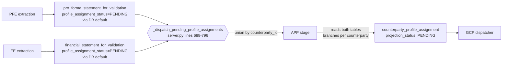

<!-- Source of truth: Corridor Credit Claude Chat project. Do not edit unilaterally — update via project context first, then push to both repos. -->

# Corridor Credit — Railway Pipeline Service Reference

## What This Service Does

The Railway service is the single pipeline orchestrator for the Corridor Credit platform.
It runs a background polling loop that discovers work by scanning Supabase tables for
PENDING status values, executes the appropriate transforms, and writes results back
to Supabase. The Next.js frontend never tells this service which transform to run —
it discovers work autonomously.

## Polling Loop Architecture

### Toggle & Interval

- Polling interval: 120 seconds (`POLL_INTERVAL_SECONDS` in `server.py`)
- Default on startup: OFF (`POLLING_ENABLED` env var, defaults to `"false"`)
- Runtime toggle: `POST /api/polling/start`, `POST /api/polling/stop`
- Status check: `GET /api/polling/status`
- Wake signal: `POST /api/wake` — interrupts the sleep timer to force exactly one
  polling cycle, **regardless of whether polling is enabled**. Does not enable
  continuous polling.
- All toggle state is in-memory only — does not persist across restarts

### Dispatch Order (each polling cycle)

The polling loop executes these steps sequentially. Intake runs first via
`_poll_intake()`, then the four status-driven dispatchers run in dependency order
via `_run_all_status_dispatches()`:

1. **INTAKE** (`_poll_intake`, `server.py`)
   - Scans `raw-emails` storage bucket for new files
   - Runs: A1 → A3 → A4 → A5 → CPC → LDC
   - No status column — tracks seen files via `_intake_known_files` in memory,
     seeded on first poll from the `email` table (`file_name` column) so that
     server restarts do not re-process every file in the bucket

2. **EXTRACTION DISPATCH** (`_dispatch_pending_extractions`, `server.py`)
   - Table: `workflow_for_validation`
   - Status column: `extraction_status`
   - Trigger: `PENDING`
   - Routes by three independent boolean columns (`_stages_from_booleans`):
     - `has_contract_terms = true` → `[te, ecv]`
     - `has_historical_financials = true` → `[fe, esv]`
     - `has_pro_forma_financials = true` → `[pfe, epf]`
   - Booleans are additive — a CIM with terms + pro forma but no historicals
     dispatches `[te, ecv, pfe, epf]` (FE/ESV are skipped)
   - **Fallback:** If all three booleans are `NULL` (pre-migration rows),
     falls back to `document_content_flags` enum routing via `CONTENT_FLAG_STAGES`
   - Lifecycle: `PENDING → IN_PROGRESS → COMPLETE` (or `ERROR`)

3. **OBLIGATION DISPATCH** (`_dispatch_pending_obligations`, `server.py`)
   - Table: `contract_for_validation`
   - Status column: `obligation_extraction_status`
   - Trigger: `PENDING`
   - Reads `source_document_id` from the contract row (fallback to `document_id`)
   - Runs: `[eo, eotsv]`
   - Lifecycle: `PENDING → IN_PROGRESS → COMPLETE` (or `ERROR`)

4. **PROFILE ASSIGNMENT DISPATCH** (`_dispatch_pending_profile_assignments`, `server.py`)
   - Table: `financial_statement_for_validation`
   - Status column: `profile_assignment_status`
   - Trigger: `PENDING`
   - Groups by `counterparty_id` — runs once per counterparty, not per statement
   - Runs: `[app]`
   - Lifecycle: `PENDING → IN_PROGRESS → COMPLETE` (or `ERROR`)

5. **PROJECTION DISPATCH** (`_dispatch_pending_projections`, `server.py`)
   - Table: `counterparty_profile_assignment`
   - Status column: `projection_status`
   - Trigger: `PENDING`
   - Runs: `[gcp]` — called once with `document_id=None`, processes all
     IN_PROGRESS counterparties internally
   - Lifecycle: `PENDING → IN_PROGRESS → COMPLETE` (or `ERROR`)

### Pipeline Stage Codes

| Code  | Name                                          | File                                                        |
|-------|-----------------------------------------------|-------------------------------------------------------------|
| A1    | Email Processing                              | `pipeline/email_processing.py`                              |
| A3    | Document Processing (A2 storage + A3b PDF)    | `pipeline/document_processing.py`                           |
| A4    | Workflow Validation (LLM classification)      | `pipeline/workflow_validation.py`                           |
| A5    | Deal Orchestrator                             | `pipeline/deal_orchestrator.py`                             |
| CPC   | Consolidate Prospective Counterparties        | `pipeline/consolidate_counterparties.py`                    |
| LDC   | Link Document Chunks                          | `pipeline/link_document_chunks.py`                          |
| TE    | Terms Extraction (6-pass parallel)            | `pipeline/terms_extraction.py`                              |
| FE    | Financial Extraction                          | `pipeline/financial_extraction.py`                          |
| PFE   | Pro Forma Extraction                          | `pipeline/pro_forma_extraction.py`                          |
| EO    | Extract Obligations                           | `pipeline/extract_obligations.py`                           |
| ECV   | Establish Contract for Validation             | `pipeline/establish_contract_validation.py`                 |
| ESV   | Establish Statement for Validation            | `pipeline/establish_statement_validation.py`                |
| EPF   | Establish Pro Forma for Validation            | `pipeline/establish_proforma_validation.py`                 |
| EOTSV | Establish Obligation Term Structure Validation| `pipeline/establish_obligation_term_structure_validation.py` |
| APP   | Assign Projection Profile                     | `pipeline/assign_projection_profile.py`                     |
| GCP   | Generate Counterparty Projections             | `pipeline/generate_projections.py`                          |

### Intake Pipeline Stages

The intake pipeline (`FULL_PIPELINE_ORDER` in `main.py`) runs these stages in order:
`A1 → A3 → A4 → A5 → CPC → LDC`

A4 creates `workflow_for_validation` records with `extraction_status = 'PENDING'`,
which causes the extraction dispatch step to pick them up on the same or next cycle.

## API Endpoints

### Active

| Method | Path                  | Purpose                                                    |
|--------|-----------------------|------------------------------------------------------------|
| GET    | `/health`             | Health check                                               |
| POST   | `/api/polling/start`  | Enable continuous polling                                  |
| POST   | `/api/polling/stop`   | Disable continuous polling                                 |
| GET    | `/api/polling/status` | Check polling state — returns `{"polling":"enabled"}` or `{"polling":"disabled"}` |
| POST   | `/api/wake`           | Force one immediate poll cycle (works even when polling off)|
| POST   | `/api/process`        | Run arbitrary stages for a document (used by tests/admin)  |
| GET    | `/api/debug/query`    | Query safe-listed Supabase tables (temporary debug tool)   |

### Deprecated (functional but log warnings)

| Method | Path                               | Replacement                                            |
|--------|------------------------------------|---------------------------------------------------------|
| POST   | `/api/extract`                     | Set `extraction_status='PENDING'` + `POST /api/wake`   |
| POST   | `/api/dispatch-obligations`        | Set `obligation_extraction_status='PENDING'` + wake     |
| POST   | `/api/dispatch-profile-assignment` | Set `profile_assignment_status='PENDING'` + wake        |

## Status-Driven Dispatch Contract

The Next.js application sets status columns to `PENDING` on Supabase records.
This service discovers those PENDING records and processes them.
This service **NEVER** receives instructions about which transform to run from
the frontend — it reads the data and determines the appropriate action.

### What Sets PENDING Values

| Status Column                                                  | What Sets It                                          |
|----------------------------------------------------------------|-------------------------------------------------------|
| `workflow_for_validation.extraction_status`                    | A4 (workflow validation) during intake                |
| `contract_for_validation.obligation_extraction_status`         | Next.js `/api/contract-analysis/validate`             |
| `financial_statement_for_validation.profile_assignment_status` | Next.js statement validation                          |
| `counterparty_profile_assignment.projection_status`            | APP stage on completion                               |

### Implicit Schema Requirements (`_set_status` helper)

Railway's `db.py` uses a `_set_status` helper to write status transitions on every
dispatch table. This helper writes **three columns** on each transition:

| Column | Type | Written When |
|--------|------|-------------|
| `{status_column}` | TEXT | Every transition (`IN_PROGRESS`, `COMPLETE`, `ERROR`) |
| `completed_at` | TIMESTAMPTZ | On `COMPLETE` — marks when processing finished |
| `error_details` | TEXT | On `ERROR` — diagnostic info; cleared to NULL on success |

**Every table that has a dispatch status column MUST also have `completed_at` and
`error_details` columns.** If either is missing, PostgREST returns PGRST204 and the
entire status update fails — the record stays stuck at its previous status and gets
re-dispatched indefinitely.

Tables that require these columns:

| Table | Status Column | `completed_at` | `error_details` |
|-------|--------------|-----------------|-----------------|
| `workflow_for_validation` | `extraction_status` | Required | Required |
| `contract_for_validation` | `obligation_extraction_status` | Required | Required |
| `financial_statement_for_validation` | `profile_assignment_status` | Required | Required |
| `counterparty_profile_assignment` | `projection_status` | Required | Required |
| `enriched_workflow` | *(A5 stage)* | Required | Required |

**PostgREST schema cache:** After adding columns via `ALTER TABLE`, PostgREST won't
see them until you run `NOTIFY pgrst, 'reload schema'` in the SQL Editor. Without
this, Railway continues to get PGRST204 even though the column exists.

### APP Stage Profile Metadata Columns

Railway's APP stage (`assign_projection_profile.py`) copies 7 metadata fields from
`projection_profile` into `counterparty_profile_assignment` via `_join_profile_metadata()`.
These columns are not in the original `schema.sql` and were added via migration
`20260328_add_missing_pipeline_columns.sql`:

- `profile_capex_intensity` (NUMERIC)
- `profile_description` (TEXT)
- `profile_display_name` (TEXT)
- `profile_key_assumptions` (TEXT)
- `profile_typical_industries` (TEXT)
- `profile_revenue_growth_assumption` (TEXT)
- `profile_margin_assumption` (TEXT)

If any of these are missing, APP fails with PGRST204 and `profile_assignment_status`
gets stuck at `ERROR` on the corresponding `financial_statement_for_validation` records.

### Idempotency Guards (Validated Data Protection)

Three layers prevent intake re-runs from destroying user-validated data:

**Root cause fix — Persistent intake tracking (`server.py`):** On first poll,
`_intake_known_files` is seeded from the `email` table's `file_name` column
(written by A1). Server restarts no longer treat all bucket files as new.

**Guard A — A4 (`workflow_validation.py`):** Before upserting workflow records, reads
existing `workflow_for_validation` rows. If `extraction_status` is already `COMPLETE`,
or `IN_PROGRESS`, the workflow is **skipped entirely** — same EML produces
same A4 output, so a partial metadata update would make the workflow inconsistent
with its extraction output. The inbox edit route handles the legitimate re-extraction
case by explicitly resetting `extraction_status` to `PENDING`.

**Guard B — ECV (`establish_contract_validation.py`):** Before upserting contract and
term records, reads existing `contract_for_validation` and `term_for_validation` rows.
If `contract_status` or `validation_status` is `VALIDATED`, the existing status is
preserved. This is defense-in-depth — even if extraction somehow re-runs, user
validation decisions are not lost.

### Pipeline-Overwrite Protection

This service writes to `_for_validation` staging tables only.
It **NEVER** writes to canonical/ontology tables (`workflow`, `contract`,
`counterparty`, `obligation`, `financial_statement`).
Canonical tables are written exclusively by Next.js validate routes
when the user promotes validated data.

## What NOT to Do

- Don't create new imperative endpoints that accept document_ids or parameters
  telling the service what to process. The polling loop discovers work via status columns.
- Don't write to canonical tables. Write to `_for_validation` staging tables only.
- Don't skip the `IN_PROGRESS` status write before starting a transform.
- Don't leave status as `PENDING` after processing — always set `COMPLETE` or `ERROR`.
- Don't change `_poll_cycle()` dispatch order — it reflects the pipeline dependency chain.

## Key Files

| File           | Purpose                                                         |
|----------------|-----------------------------------------------------------------|
| `server.py`    | FastAPI app, polling loop, all dispatch logic, API endpoints    |
| `main.py`      | Stage registry (`STAGES`), `FULL_PIPELINE_ORDER`, CLI runner   |
| `config.py`    | Environment variable loading (dotenv)                           |
| `db.py`        | Supabase client, `read_table`, `upsert_rows`, `list_files`     |
| `pipeline/`    | One module per pipeline stage                                   |

## Per-Stage Reference

Each stage's contract: what it reads, what it writes, what triggers it, what
must be true for it to produce output, what it returns, how it fails, and what
protects it against overwriting validated or in-flight data.

### A1 — Email Processing

**Source file:** `pipeline/email_processing.py`

| Field | Description |
|---|---|
| **Reads from** | Supabase Storage bucket `raw-emails` via `db.list_files()` and `db.download_file()`. No DB table reads. |
| **Writes to** | `email` (upsert by `email_id`), `attachment` (upsert, FK to `email.email_id`). PDF/DOC/DOCX/PPT/PPTX attachments uploaded to `attachments` bucket at path `{email_id}/{attachment_name}`. |
| **Trigger condition** | Intake phase of polling loop (`_poll_intake` in `server.py`); runs when `_intake_known_files` (seeded from `email.file_name`) does not contain a file present in the `raw-emails` bucket. No status column. |
| **Input requirements** | At least one file in `raw-emails` bucket. If zero files or zero parsed, logs warning and returns. |
| **Output** | N email rows, N attachment rows. `email_id` derived from SHA-256 of subject; attachment binaries persisted to `attachments` bucket. |
| **Error behavior** | Per-file attachment upload wrapped in try/except (logs error, continues). No stage-level status column — failures are logged, downstream stages simply see no new rows. |
| **Guard logic** | Bucket-file dedup via `_intake_known_files` in `server.py` (seeded from `email.file_name` on first poll). In-stage dedup of rows before upsert. |

### A3 — Document Processing

**Source file:** `pipeline/document_processing.py`

| Field | Description |
|---|---|
| **Reads from** | `attachment` (no filter; optionally filters to a `document_id`'s `email_id` via `document` lookup). Attachment binaries read from `attachments` bucket. |
| **Writes to** | `document` (upsert by `document_id`), `document_chunk` (upsert by `contract_chunk_id`). PDF bytes written to `pdf` bucket for non-PDF attachments. |
| **Trigger condition** | Runs in intake pipeline after A1 (FULL_PIPELINE_ORDER position 2). No status column. |
| **Input requirements** | Attachment rows exist with `file_type ∈ {pdf, doc, docx, ppt, pptx}` and downloadable binaries in `attachments` bucket. |
| **Output** | One document row per allowed-type attachment (with `complete_document_text`, `pdf_storage_path`), plus N chunk rows per document (sections or `full_document` fallback). `document_id` = SHA-256 of `sent_timestamp + attachment_name`. |
| **Error behavior** | Per-attachment download/extraction failures logged and skipped. No stage-level status. |
| **Guard logic** | In-stage dedup of `document_id` and `contract_chunk_id` before upsert. `file_type` whitelist filter. |

### A4 — Workflow Validation

**Source file:** `pipeline/workflow_validation.py`

| Field | Description |
|---|---|
| **Reads from** | `document_chunk` (optionally filtered to `document_id`), `document`, `email`, `counterparty` (filter `status='ACTIVE'` then `status='PENDING_ENRICHMENT'`), `obligation` (filter in-memory to `status='ACTIVE' AND obligation_type='REPORTING'`), `crdr_prompt` (filter `prompt_id='CRDR_PROMPT_17'`), `workflow_for_validation` (for Guard A read). |
| **Writes to** | `counterparty` (upsert by `counterparty_id`, new PROSPECT records), `workflow_for_validation` (upsert by `workflow_for_validation_id`, explicitly setting `extraction_status='PENDING'`). |
| **Trigger condition** | Runs in intake pipeline after A3. No status column on this stage itself — A4 is what creates the PENDING `extraction_status` that drives the extraction dispatcher. |
| **Input requirements** | At least one chunk per document for LLM classification (first 6 by chunk_id). |
| **Output** | One workflow_for_validation row per unique document_id; sets `workflow_stage='CLASSIFIED'`, `workflow_status='SUCCESS'`, `document_content_flags`, `has_contract_terms/has_historical_financials/has_pro_forma_financials` booleans, `counterparty_id` (matched or new CTR_*), optional `matched_obligation_id` via scoring. |
| **Error behavior** | LLM errors fall back to `FALLBACK_RESPONSE = "No Counterparty\|TERMS\|..."`. Invalid field counts produce fallback. No stage status write on error. |
| **Guard logic** | **Guard A** — before upserting, reads existing `workflow_for_validation` and skips entire rows where `extraction_status ∈ {COMPLETE, IN_PROGRESS}`. Inbox re-extraction path resets status to PENDING externally. |

### A5 — Deal Orchestrator

**Source file:** `pipeline/deal_orchestrator.py`

| Field | Description |
|---|---|
| **Reads from** | `workflow_for_validation` (optionally filtered to `document_id`), `document`, `counterparty`. |
| **Writes to** | `deal` (upsert by `deal_id`), `facility` (upsert by `facility_id`), `deal_document` (upsert by `deal_document_id`, in-stage deduped), `enriched_workflow` (upsert, always written — includes non-contract workflows with null deal/facility). |
| **Trigger condition** | Runs in intake pipeline after A4. No status column. |
| **Input requirements** | Workflows with `has_contract_terms=true` (three-boolean routing, aligned with A4 dispatch — migrated from the prior `workflow_type=='CONTRACT'` filter). |
| **Output** | N deals (grouped by counterparty + 30-day `DEAL_GROUPING_WINDOW_DAYS`), N facilities (keyword-classified by facility_type), one deal_document row per contract workflow, one enriched_workflow row per input workflow. |
| **Error behavior** | Timestamp parse errors handled defensively. No stage status write. |
| **Guard logic** | Contract-vs-other split on `has_contract_terms is True`; non-contract workflows still get an enriched_workflow row with null deal context. In-stage dedup of `deal_document_id`. |

### CPC — Consolidate Prospective Counterparties

**Source file:** `pipeline/consolidate_counterparties.py`

| Field | Description |
|---|---|
| **Reads from** | `counterparty` (filter `status='PENDING_ENRICHMENT'`), then `counterparty` again (filter `status='ACTIVE'`). |
| **Writes to** | `prospective_counterparty` (upsert by `prospective_counterparty_id = 'PCTR_' + counterparty_id`). |
| **Trigger condition** | Runs in intake pipeline after LDC-predecessors (FULL_PIPELINE_ORDER position 5). No status column. |
| **Input requirements** | At least one counterparty with `status='PENDING_ENRICHMENT'` that is not already in the ACTIVE set. |
| **Output** | N prospective_counterparty rows with `data_quality_score` (0–100), `mention_count`, `potential_duplicate` flag, `validation_status='PENDING_VALIDATION'`. |
| **Error behavior** | No try/except — exceptions propagate to `_poll_intake` which logs and returns False. |
| **Guard logic** | Filters out counterparty_ids already present as ACTIVE. Dedups staging rows by counterparty_id (keeps most recent `onboarding_date`). |

### LDC — Link Document Chunks

**Source file:** `pipeline/link_document_chunks.py`

| Field | Description |
|---|---|
| **Reads from** | `document_chunk` (optionally filtered to `document_id`), `enriched_workflow`. |
| **Writes to** | `linked_document_chunk` (upsert, key implicit from Supabase client). |
| **Trigger condition** | Final intake stage (FULL_PIPELINE_ORDER position 6). No status column. |
| **Input requirements** | At least one document_chunk row; workflow lookup by `document_id` is best-effort. |
| **Output** | One linked_document_chunk per input chunk, enriched with `workflow_for_validation_id`, `counterparty_id`, `obligation_id` from the workflow. |
| **Error behavior** | No try/except — exceptions propagate. |
| **Guard logic** | None beyond upsert idempotency — pure join/enrichment stage. |

### TE — Terms Extraction

**Source file:** `pipeline/terms_extraction.py`

| Field | Description |
|---|---|
| **Reads from** | `workflow_for_validation` (filter in-memory to `workflow_stage='CLASSIFIED' AND workflow_status LIKE 'SUCCESS%'`; optional `document_id` filter), `contract_extraction_pass` (filter `pass_name='MERGED'` for skip check), `document_chunk`, `crdr_prompt` (filter `prompt_id ∈ CRDR_PROMPT_2..7`). |
| **Writes to** | `contract_extraction_pass` (upsert by synthetic `id = SHA256(workflow_id_pass_n)`); writes 6 diagnostic rows (pass_number 1–6) plus one `MERGED` row with `pass_number=0`, all per workflow. |
| **Trigger condition** | Called by extraction dispatcher when `workflow_for_validation.extraction_status='PENDING'` AND `has_contract_terms=true`. |
| **Input requirements** | Classified workflow with associated document chunks containing >100 chars each. |
| **Output** | Per workflow: 6 pass rows + 1 MERGED row with `merge_status`, `passes_completed`, unpivoted entity columns like `pass_1_Facility_Type`. No direct write to contract_for_validation — that's ECV's job. |
| **Error behavior** | Per-pass LLM failures or JSON parse errors produce a diagnostic row with `status ∈ {llm_error, json_parse_error, empty_input, no_prompt, exception}` but do not abort the workflow. Stage does not set any dispatch status — the dispatcher sets `extraction_status=ERROR` only if the overall run_stages call raises. |
| **Guard logic** | Skips workflows that already have a MERGED row with `merge_status='success'` AND at least one `pass_N_*` entity key. Runs 6 passes in parallel via ThreadPoolExecutor(max_workers=6). |

### FE — Financial Extraction

**Source file:** `pipeline/financial_extraction.py`

| Field | Description |
|---|---|
| **Reads from** | `workflow_for_validation` (same CLASSIFIED+SUCCESS filter as TE), `reporting_entity_extraction` (for skip check), `document_chunk`, `crdr_prompt` (filter `prompt_id='CRDR_PROMPT_1'`). |
| **Writes to** | `reporting_entity_extraction` (upsert by `id = SHA256(workflow_for_validation_id)`). |
| **Trigger condition** | Called by extraction dispatcher when `extraction_status='PENDING'` AND `has_historical_financials=true`. |
| **Input requirements** | Document chunks with >100 chars. Single-pass LLM call per workflow. |
| **Output** | One diagnostic row per workflow with 34-GAAP-line-item × 3-period template, `extraction_status ∈ {success, no_chunks, empty_chunks, llm_error, json_parse_error}`. Downstream rows in FSV are written by ESV, not FE. |
| **Error behavior** | Writes an explicit result row for each failure mode (no silent drops). Dispatcher only sees ERROR if the stage raises. |
| **Guard logic** | Skips workflows where an existing `reporting_entity_extraction` row already has `extraction_status='success'`. |

### PFE — Pro Forma Extraction

**Source file:** `pipeline/pro_forma_extraction.py`

| Field | Description |
|---|---|
| **Reads from** | `workflow_for_validation` (CLASSIFIED+SUCCESS), `pro_forma_entity_extraction` (for skip check), `document_chunk`, `crdr_prompt` (filter `prompt_id='CRDR_PROMPT_9'`). |
| **Writes to** | `pro_forma_entity_extraction` (upsert by `id = SHA256(workflow_for_validation_id)`). |
| **Trigger condition** | Called by extraction dispatcher when `extraction_status='PENDING'` AND `has_pro_forma_financials=true`. |
| **Input requirements** | Document chunks with >100 chars. Single-pass LLM per workflow. |
| **Output** | One diagnostic row per workflow with 34-line-item × 3-projected-period template; `extraction_status` mirror of FE. |
| **Error behavior** | Same pattern as FE — explicit status row per failure mode. |
| **Guard logic** | Skips workflows where `pro_forma_entity_extraction.extraction_status='success'` already. |

### EO — Extract Obligations

**Source file:** `pipeline/extract_obligations.py`

| Field | Description |
|---|---|
| **Reads from** | `term_for_validation` (in-memory filter to `validation_status ∈ {VALIDATED, APPROVED, CONFIRMED}`; optional `document_id` filter), `contract_for_validation`. |
| **Writes to** | `obligation_for_validation` (upsert by `obligation_for_validation_id = 'ofv_' + cfv_id + '_' + term_identity`). |
| **Trigger condition** | Called by obligation dispatcher when `contract_for_validation.obligation_extraction_status='PENDING'`. Scoped by `source_document_id` (fallback `document_id`). |
| **Input requirements** | At least one validated term whose normalized `term_identity` appears in `OBLIGATION_TERM_IDENTITIES` (49 identities across 5 obligation types). |
| **Output** | N obligation rows per contract with classified `obligation_type` (PAYMENT_OBLIGATION, FINANCIAL_COVENANT, REPORTING_REQUIREMENT, COLLATERAL_MONITORING, NEGATIVE_COVENANT), threshold/frequency/next_due_date computed. Dates resolved from contract row or from date-typed source terms. |
| **Error behavior** | Per-term failures (date parse, threshold parse) produce None for the affected field but don't abort. Stage-level exceptions propagate to the dispatcher, which sets `obligation_extraction_status='ERROR'`. |
| **Guard logic** | Skips terms whose identity is not in `_OBLIGATION_IDENTITY_SET` (silently). Pre-scan collects date fallbacks from terms for contracts missing canonical dates. |

### ECV — Establish Contract for Validation

**Source file:** `pipeline/establish_contract_validation.py`

| Field | Description |
|---|---|
| **Reads from** | `contract_extraction_pass` (filter `pass_name='MERGED'`; optional `document_id`), `workflow_for_validation`, `contract_for_validation` (Guard B read), `term_for_validation` (Guard B read). |
| **Writes to** | `contract_for_validation` (upsert by `contract_for_validation_id = 'cfv_' + wfv_id`; initial `contract_status='DRAFT'`; does not explicitly set `obligation_extraction_status='PENDING'` — relies on DB default on insert), `term_for_validation` (upsert by `term_for_validation_id = 'tfv_' + wfv_id + '_' + key`). |
| **Trigger condition** | Runs after TE in the extraction dispatcher's `[te, ecv]` bundle. No independent status. |
| **Input requirements** | At least one MERGED contract_extraction_pass row with `merge_status='success'` and `passes_completed>0`. |
| **Output** | One contract row per workflow (carrying contract-level fields like `contract_type`, `origination_date`, `maturity_date`) + N term rows (unpivot of merged data keys, excluding metadata/contract-level/confidence suffixes). |
| **Error behavior** | Per-workflow JSON parse or merge_status errors logged and skipped. |
| **Guard logic** | **Guard B** — reads existing contracts and terms and preserves `contract_status='VALIDATED'` / `validation_status='VALIDATED'` in the new upsert payload rather than reverting to DRAFT/PENDING. Dedups MERGED rows to latest `created_at` per workflow. |

### ESV — Establish Statement for Validation

**Source file:** `pipeline/establish_statement_validation.py`

| Field | Description |
|---|---|
| **Reads from** | `reporting_entity_extraction` (in-memory filter to `extraction_status='success'`; optional `document_id`), `workflow_for_validation`. |
| **Writes to** | `financial_statement_for_validation` (upsert by `id = 'fsfv_' + wfv_id + '_' + period_num`). Does not explicitly set `profile_assignment_status='PENDING'` — relies on DB default on insert. |
| **Trigger condition** | Runs after FE in the extraction dispatcher's `[fe, esv]` bundle. No independent status. |
| **Input requirements** | At least one successful reporting_entity_extraction row; per-period, at least one extractable non-null value across the 34 line items. |
| **Output** | Up to 3 rows per workflow (one per period with non-null data), with `period_end_date`, `period_end_month/year`, `statement_title`, plus all 34 GAAP columns populated from parsed entity values. |
| **Error behavior** | Per-workflow JSON parse errors logged and skipped. In-stage `_consolidate_rows` merges duplicates by id taking first non-null per field. |
| **Guard logic** | Dedups extraction rows to latest `created_at` per workflow. No validated-data preservation — assumes canonical promotion is the guard layer. |

### EPF — Establish Pro Forma for Validation

**Source file:** `pipeline/establish_proforma_validation.py`

| Field | Description |
|---|---|
| **Reads from** | `pro_forma_entity_extraction` (filter `extraction_status='success'`; optional `document_id`), `workflow_for_validation`. |
| **Writes to** | `pro_forma_statement_for_validation` (upsert by `id = 'pfsfv_' + wfv_id + '_' + period_num`). Does not explicitly set `profile_assignment_status='PENDING'` — relies on DB default on `pro_forma_statement_for_validation`. |
| **Trigger condition** | Runs after PFE in the extraction dispatcher's `[pfe, epf]` bundle. No independent status. |
| **Input requirements** | At least one successful pro_forma_entity_extraction row; per-period, at least one non-null of the 34 line items. |
| **Output** | Up to 3 pro-forma statement rows per workflow with `statement_title = "Pro Forma Statement - " + period_label`. Exact mirror of ESV shape, different target table. Does not write anything to `financial_statement_for_validation`. |
| **Error behavior** | Same defensive pattern as ESV. |
| **Guard logic** | Dedups to latest extraction `created_at` per workflow. No canonical-preservation guard. |

### EOTSV — Establish Obligation Term Structure for Validation

**Source file:** `pipeline/establish_obligation_term_structure_validation.py`

| Field | Description |
|---|---|
| **Reads from** | `obligation_for_validation` (in-memory filter `obligation_type='PAYMENT_OBLIGATION'`; optional `document_id`), `term_for_validation` (two reads: per-obligation `source_term_id` lookup for date-typed obligations, and per-contract fallback by `contract_for_validation_id` for missing dates). |
| **Writes to** | `obligation_term_structure_for_validation` (upsert by `obligation_event_id = 'OTS_' + cfv_id + '_' + payment_number:03d`). |
| **Trigger condition** | Runs after EO in the obligation dispatcher's `[eo, eotsv]` bundle. No independent status. |
| **Input requirements** | Payment obligations with sufficient parameters per contract: `facility_amount`, `origination_date`, `maturity_date`. Others (frequency, amortization_type) default. |
| **Output** | N payment events per contract (one row per scheduled payment), with `scheduled_principal/interest/total_payment`, `outstanding_principal_beginning/ending`, `payment_status`, `data_quality_score`, `validation_status='PENDING'`. Interest uses SOFR=5% assumption + spread. |
| **Error behavior** | Contracts with incomplete params are skipped with WARNING (e.g., missing maturity_date); logged as `contracts_skipped`. Exceptions propagate to dispatcher. |
| **Guard logic** | No VALIDATED preservation — pipeline overwrites on re-run. Protection relies on the promote-on-validate canonical layer being separate. |

### APP — Assign Projection Profile

**Source file:** `pipeline/assign_projection_profile.py`

| Field | Description |
|---|---|
| **Reads from** | `financial_statement_for_validation` (no PENDING filter — reads ALL rows), `pro_forma_statement_for_validation` (no PENDING filter — reads ALL rows), `counterparty` (filter `status='ACTIVE'`), `projection_profile` (best-effort). |
| **Writes to** | `counterparty_profile_assignment` (upsert by `counterparty_id`, explicitly sets `projection_status='PENDING'`). |
| **Trigger condition** | Called by profile assignment dispatcher when **either** `financial_statement_for_validation.profile_assignment_status='PENDING'` **OR** `pro_forma_statement_for_validation.profile_assignment_status='PENDING'` — grouped by counterparty_id, runs once per counterparty. |
| **Input requirements** | At least one statement (historical or pro forma) for a counterparty. Two internal paths: `_process_counterparty` (historicals-bearing) and `_process_counterparty_pro_forma_only` (pro-forma-only, e.g., Solar Valley). |
| **Output** | One assignment row per counterparty with `assigned_profile_id` (from `PROFILE_MAPPING`), `effective_profile_id`, NAICS-derived `logical_profile_category`, `revenue_size_bucket`, `projection_method` (historicals: cagr/recent/seasonal_cagr/average; pro-forma-only: forced to `pass_through`), 7 joined profile metadata columns, rationale text, `projection_status='PENDING'` (which triggers GCP). |
| **Error behavior** | LLM not used here. `projection_profile` read wrapped in try/except (falls back to empty set). Fallback profile chain `FALLBACK_PROFILE_PRIORITY` applied if `assigned_profile_id` missing from available profiles. |
| **Guard logic** | Counterparties with BOTH historicals and pro formas route to historicals path (historicals win). Dispatcher scopes per-counterparty; APP does not skip counterparties that already have an assignment row — full overwrite on every dispatch. |

### GCP — Generate Counterparty Projections

**Source file:** `pipeline/generate_projections.py`

| Field | Description |
|---|---|
| **Reads from** | `counterparty_profile_assignment` (in-memory filter `projection_status ∈ {PENDING, IN_PROGRESS}`, or optional `document_id`-scoped subset via FSV lookup), `financial_statement_for_validation`, `projection_profile`, `obligation_term_structure_for_validation`, `pro_forma_statement_for_validation` (filter `counterparty_id` in pro-forma-only branch), `contract` (filter `counterparty_id` for anchor date resolution). |
| **Writes to** | `counterparty_projection` (upsert by `counterparty_projection_id = 'CPJ_' + counterparty_id`, WIDE format — one row per counterparty with `{metric}_y{Y}_q{Q}` columns), `counterparty_projection_summary` (upsert by `projection_summary_id = 'CPS_' + counterparty_id`). |
| **Trigger condition** | Called by projection dispatcher when `counterparty_profile_assignment.projection_status='PENDING'`. Invoked once per poll cycle with `document_id=None`; GCP processes all PENDING/IN_PROGRESS counterparties internally. |
| **Input requirements** | Counterparty_profile_assignment row with PENDING/IN_PROGRESS. Either historical financial statements OR pro forma statements with non-null flow items — otherwise raises ValueError for that counterparty. |
| **Output** | Per counterparty: one wide projection row with 12 quarterly periods of revenue, CFADS, DSCR_{corridor,pari_passu,total}, debt service, balance sheet; one summary row with `min_dscr_value`, `min_dscr_period`, `dscr_buffer`, `llcr`, `dscr_classification`, `dscr_stress_driver`. Pro-forma path overrides driver to "Sponsor P50 pass-through (no historical financials)". |
| **Error behavior** | Per-counterparty exceptions caught and logged; counts against `errors` tally. Dispatcher sets all claimed counterparties to ERROR only if `run_stages(["gcp"], ...)` itself raises (any single failure before the write step can escape). |
| **Guard logic** | Per-counterparty branch: `_get_latest_statement` → historicals path; no statement → `_process_counterparty_pro_forma` pass-through. OTS-coverage gate (`_OTS_MIN_COVERAGE=4` of 12 quarters populated) falls back to pro forma `interest_expense` as debt service proxy. |

## EPF → APP Coupling Mechanism

For counterparties with zero historical financials and therefore zero rows in
`financial_statement_for_validation` (e.g., project-finance credits like Solar
Valley and Cascade Crossing), APP still runs and produces a profile assignment.
The mechanism is not a placeholder row or accidental permissiveness — it is an
explicit union inside the profile-assignment dispatcher.

### Where the coupling lives

- **`server.py` `_dispatch_pending_profile_assignments()` (lines 688–796)**
  reads BOTH `financial_statement_for_validation` (filter
  `profile_assignment_status='PENDING'`) AND
  `pro_forma_statement_for_validation` (filter `profile_assignment_status='PENDING'`),
  builds a `counterparty → {"fsv": [...], "pfsv": [...]}` map keyed by
  `counterparty_id`, and runs `app` once per counterparty regardless of which
  source contributed the PENDING row. On completion it walks both source lists
  and writes COMPLETE (or ERROR) back to whichever table owns each row.

- **`pipeline/assign_projection_profile.py` `run()` (lines 153–233)** reads both
  tables unconditionally (no PENDING filter) and branches per counterparty:
  `_process_counterparty` when there is at least one historical statement,
  otherwise `_process_counterparty_pro_forma_only` (lines 326–389). The
  pro-forma-only path writes `projection_method='pass_through'`,
  `historical_period_count=0`, and sources `annual_revenue` from the earliest
  projected year of the pro forma.

- **`pipeline/establish_proforma_validation.py` (line 267)** — EPF writes only
  to `pro_forma_statement_for_validation`. It sets
  `profile_assignment_status='PENDING'` implicitly via the column's DB default
  on insert; it never writes the status column directly. That insert is what
  the dispatcher discovers.

### Corrected flow fragment (replaces the dashed arrow in CRDR_PIPELINE_ROUTING.md §6)

### Incidental findings

- **Brittleness around DB defaults.** EPF, ESV, ECV, and APP's downstream
  trigger writes all rely on DB-level defaults for `*_status='PENDING'` rather
  than explicit writes. If a migration ever drops or changes those defaults
  (or the PostgREST schema-cache reload is missed after an `ALTER TABLE`),
  the pipeline silently stops triggering downstream without throwing.
  APP → GCP is the one link that writes PENDING explicitly
  (`assign_projection_profile.py` line 809), making it the most refactor-
  resilient of the four.

- **Dispatcher claim atomicity.** The dispatcher claims FSV and PFSV rows as
  IN_PROGRESS one row at a time (no transaction wrapping both). A crash
  between claiming the last FSV row and the first PFSV row for the same
  counterparty leaves a mix of IN_PROGRESS (FSV) and still-PENDING (PFSV)
  rows; the next cycle re-dispatches based on the PENDING PFSV row and
  re-claims the already-IN_PROGRESS FSV rows idempotently. APP runs twice
  but produces the same assignment — not a correctness issue, but useful to
  know when debugging repeated dispatches.

- **APP's read-all behavior is the real safety net.** Even if the dispatcher
  regressed to FSV-only polling, APP's own full-table read of
  `pro_forma_statement_for_validation` would still produce the correct
  assignment for any pro-forma-only counterparty that happened to be
  dispatched via an FSV row. For pure pro-forma-only credits (Solar Valley,
  Cascade Crossing) there is no FSV row, so the dispatcher's PFSV read is
  load-bearing — a refactor that narrows the dispatcher back to FSV-only
  would silently break those credits.

- **No tests exercise the pro-forma-only dispatch path specifically.** That
  it works is established empirically (Solar Valley produced
  `PRF_GENERAL_SMALL`), not by an integration test. Worth adding one if the
  dispatcher is revisited.
